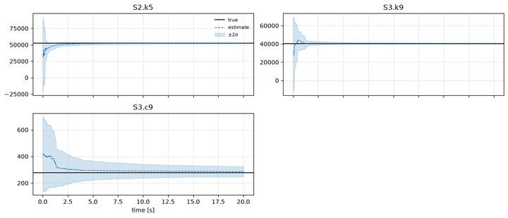
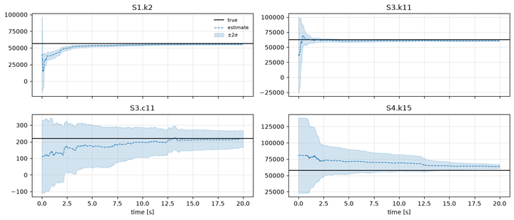
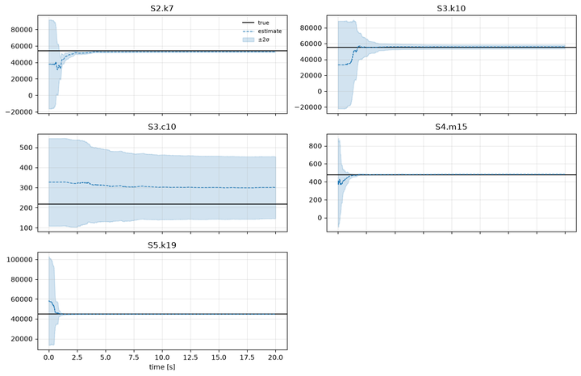
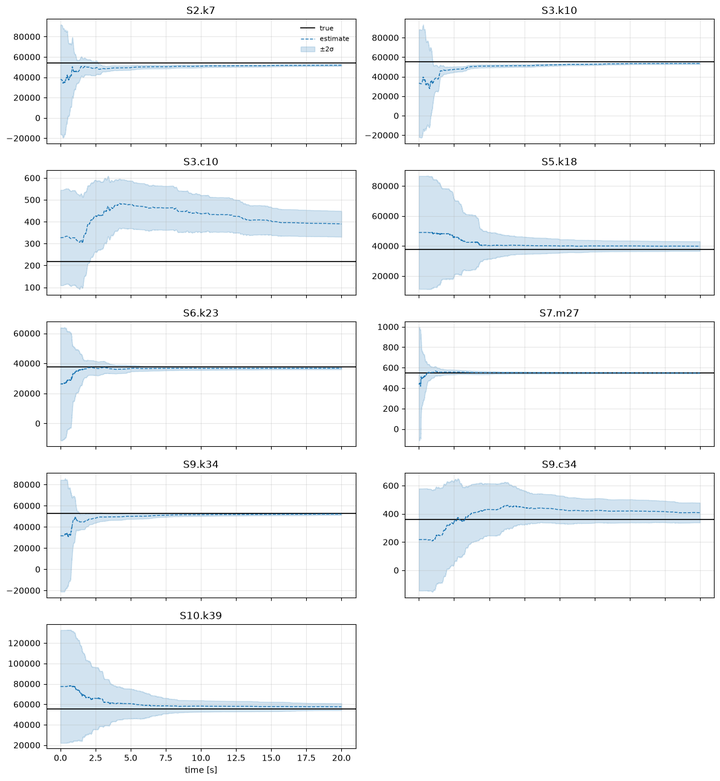

# Case studies

Larger serial chains with 9 to 40 degrees of freedom, split into 3 to 10 subsystems.
Where the [tutorials](../tutorials/README.md) teach one feature at a time, each case
study combines everything: non-uniform properties, a force on every mass, a different
filter, integrator, sensor set and task per subsystem, and one YAML twin that reproduces
the run to machine precision.

<div class="grid cards" markdown>

-   [](01_case_09dof.ipynb)

    __[9 DOF = 3 x 3-DOF](01_case_09dof.ipynb)__

    KF, UKF and CKF side by side; a grounded state-only subsystem, a free-floating one
    with two accelerometers, and one identifying a stiffness and a damping with RK4.

-   [](02_case_16dof.ipynb)

    __[16 DOF = 4 x 4-DOF](02_case_16dof.ipynb)__

    Four unknowns in three subsystems; a stiffness identified from a single
    displacement sensor on the free end.

-   [](03_case_20dof.ipynb)

    __[20 DOF = 5 x 4-DOF](03_case_20dof.ipynb)__

    Gauss-Seidel messages, an unknown mass with an EKF, and the El Centro record as the
    force on the last mass.

-   [](04_case_40dof.ipynb)

    __[40 DOF = 10 x 4-DOF](04_case_40dof.ipynb)__

    Ten local filters of 8 to 10 states each instead of one 89-state filter; nine
    unknowns, all four filter types.

</div>

## What they show

All cases: 20 s horizon at 1 ms, measurement covariance inflated 10x for the mean-only
messages, sensors with noise standard deviations from 1e-4 m to 2e-2 m/s².

| case | subsystems | filters | unknowns | stiffness / mass error | damping error | state NRMSE | run time (sequential) |
|---|---|---|---|---|---|---|---|
| 9 DOF | 3 x 3-DOF | KF, UKF, CKF | k5, k9, c9 | < 0.4 % | 2.7 % | < 0.1 % | 11 s |
| 16 DOF | 4 x 4-DOF | UKF, KF, CKF, UKF | k2, k11, c11, k15 | < 2.7 % (k15 10.6 %, one sensor) | 1.4 % | < 0.4 % | 20 s |
| 20 DOF | 5 x 4-DOF | KF, UKF, CKF, EKF, UKF | k7, k10, c10, m15, k19 | < 2 % | 38 % (c10, one sensor) | < 0.3 % | 26 s |
| 40 DOF | 10 x 4-DOF | KF, UKF, CKF, EKF (cycled) | 9 parameters | < 6 % (mass 0.4 %) | 13-78 % (single-sensor subsystems) | < 0.3 % | 42 s |

The centralized UKF on the full augmented state agrees with the distributed estimates
(9 DOF: k5 -0.44 % vs -0.47 %) at 2-3x the sequential cost and without the
one-core-per-subsystem speed-up. Dampings identified from a single displacement sensor
converge slowly, as in the paper's 6-DOF study. Jacobi, Gauss-Seidel and AB2 give the
same parameters on the 9-DOF case; Jacobi and AB2 give the smallest state errors.

## Run them yourself

```bash
cd case_studies
python 01_case_09dof.py            # ~10-40 s each at the full 20 s horizon
PCI_T=5 python 04_case_40dof.py    # shorter horizon (the YAML check runs only at 20 s)
```

Set `RUN_CENTRAL = True` in a notebook to also run the centralized UKF. The shared
helpers (chain properties, design table, report) live in `_support.py`.
