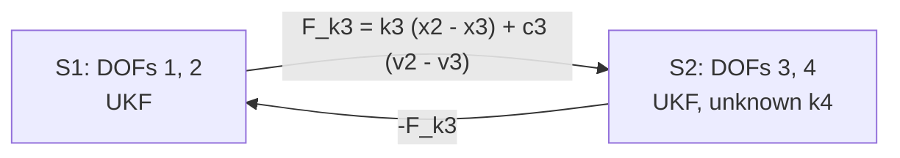

# Concepts

This page explains the vocabulary and the algorithm behind `pci`, and the one practical
point that matters most with the current version: mean-only messages need an inflated
measurement covariance. The paper[^paper] develops the framework in full; the code and
the paper use the same words.

## The interaction graph

A complex system is decomposed into **subsystems**. Each subsystem is a node of a graph
and keeps

- its own **physics**: a continuous-time state equation `f(x, u, p, t)` and a
  measurement equation `h(x, u, p, t)`;
- its own **unknown parameters**, appended to the local state as random walks;
- its own **estimator**, a Kalman-type filter chosen per subsystem;
- its own **sensors**, the columns of the measurement data it consumes.

Subsystems are connected by **interfaces**, the directed edges of the graph. An
interface carries a **message** from a sender to a receiver, built by an *interface
law* from the interface variables of both ends:

\[
m = \mathrm{law}(s_{\text{sender}}, s_{\text{receiver}}, t),
\]

and adds it (times a sign) to one of the receiver's input ports. For a spring-damper
between two masses the law is `k (x_s - x_r) + c (v_s - v_r)` and the message is the
interface force. Any callable, or any expression string, can be a law.

A **schedule** decides when messages are exchanged. Nothing global is ever assembled:
no augmented state, no joint covariance. The cost grows linearly with the number of
subsystems, and each subsystem could run on its own core.

## One time step

For every step `t_k -> t_k+1` the solver does, for each subsystem:

1. **Collect messages.** Evaluate every incoming interface law with the neighbours'
   current interface variables and sum the results on the input ports, together with
   the external loads.
2. **Predict.** Integrate the local dynamics with the local integrator (Euler, Heun or
   RK4) over `dt`, propagating the local covariance with the local filter (analytic
   Jacobians for KF/EKF, sigma points for UKF/CKF). Unknown parameters are predicted as
   random walks.
3. **Update.** Assimilate the subsystem's own sensors.

`System.simulate` runs steps 1 and 2 without filters: the coupled forward problem with
the same message passing, useful to compare schedules against a monolithic solution.

## Schedules

| schedule | how | when to use |
|---|---|---|
| `jacobi` | all subsystems use the neighbours' values from the previous step and advance in parallel | default; embarrassingly parallel |
| `gauss_seidel` | subsystems advance one after another (optional `order`) and use the most recent values of neighbours already updated | halves the coupling lag; sequential |
| `ab2` | parallel like Jacobi, with the neighbours' interface variables extrapolated to the middle of the step (Adams-Bashforth 2) | most accurate forward coupling with Heun |

`iterations > 1` refines the coupling within a step: every sweep restarts from the
prior belief at the beginning of the step and only the messages change, so a
measurement is never assimilated twice. Later sweeps use the *trapezoidal* message,
the average of the lagged message and the one rebuilt from the neighbours' latest
end-of-step estimates.

## Local estimators

| name | class | model | notes |
|---|---|---|---|
| `kf` | `LinearKalmanFilter` | linear dynamics, no unknowns | Jacobians evaluated once |
| `ekf` | `ExtendedKalmanFilter` | nonlinear, first-order linearisation | numerical Jacobians |
| `ukf` | `UnscentedKalmanFilter` | nonlinear, sigma points | `kappa` option |
| `ckf` | `CubatureKalmanFilter` | nonlinear, cubature points | no tuning parameter |

Register your own with `@pci.register_filter("name")`; particle filters, PINN-based
estimators and batch (optimisation-based) estimators are roadmap items.

**Unknown parameters** are estimated jointly with the states: `Unknown(initial, std,
process_std, lower, upper)`. `process_std` keeps the parameter covariance from
collapsing so the filter can re-learn after a bad transient; `lower`/`upper` clamp the
value handed to the physics (the filter state itself is never clipped). Masses,
stiffnesses and dampings of the built-in chain get a positive floor automatically.

**Interface parameters** that cross a partition boundary cannot be unknown yet: that is
where learned interface laws (SINDy) come in.

## Mean-only messages and R inflation

The current version exchanges **mean values** of the interface forces
(`message_type="mean"`). The incoming force carries an error the local filter does not
know about. Sensors at interface DOFs see that error directly; with `R` equal to the raw
sensor noise the coupled filters over-trust them and the message loop can diverge within
a few steps (the run stops with a clear `diverged` error).

The remedy is to inflate the measurement covariance: `R = (r_inflation * noise_std)^2`.

- `r_inflation` (default 10): 10 to 30 was robust in all multi-subsystem case studies.
  The paper's 4-DOF testbed (free-floating second subsystem, one accelerometer, 40 %
  biased stiffness guess) is the delicate one: the paper's own value (100) and the raw
  sensor noise (1) both work, while intermediate values can push the estimate to its
  lower bound during the first second, after which the collapsed covariance never
  recovers.
- `process_std` on an unknown keeps its covariance alive; use it for slowly varying or
  poorly excited parameters.
- `process_var` on the states: 1e-12 to 1e-10 worked for the chains here; the paper's
  scripts range from 1e-18 to 1e-8.

A related symptom: a free-floating subsystem measured only by accelerometers shows a
slowly growing displacement uncertainty. Its rigid-body mode is unobservable to the
local filter because the mean-only message is held fixed across sigma points, so the
receiver's covariance never sees the interface springs. The mean stays accurate; one
displacement sensor per subsystem removes the drift.

**Uncertainty-carrying messages** (`mean_variance`) will replace these heuristics: the
variance of the interface force is injected as process noise in the receiver with an
incremental rule, so information is never reused. This is the next step on the roadmap.

## Roadmap

1. Uncertainty-carrying messages (`mean_variance`).
2. Learned interface laws with SINDy as drop-in `Interface.law`.
3. More local estimators: particle filter, PINN / neural surrogates, WLS/WNLS.
4. Optimisation-based (batch) estimators and further built-in models (Kuramoto power
   networks, turbine modules) from the paper.

[^paper]: Ghorbani, E. and Hackl, J. (2026). *Subsystem Structure as an Inferential
    Resource for Coupled Engineered Systems.* [arXiv:2605.27544](https://arxiv.org/abs/2605.27544).
