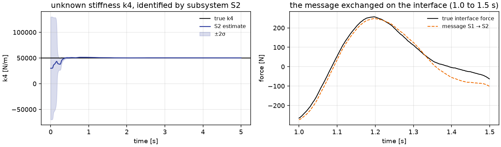

---
hide:
  - navigation
  - toc
---

<div class="pci-hero" markdown>

# pci

**Probabilistic Compositional Inference: distributed state and parameter estimation for
coupled engineered systems.**

Decompose a system into subsystems. Give each its own physics, its own unknowns and its
own Kalman-type filter. Let them talk through interface messages on a graph. No global
augmented state or covariance is ever assembled.

[](https://github.com/cisgroup/pci/actions/workflows/ci.yml)
[](https://github.com/cisgroup/pci/blob/main/LICENSE)

[](https://arxiv.org/abs/2605.27544)

{ width="760" }

[Get started](getting-started.md){ .md-button .md-button--primary }
[Tutorials](tutorials/README.md){ .md-button }
[Case studies](case-studies/README.md){ .md-button }
[API reference](reference/index.md){ .md-button }

</div>

## Install

The import name is `pci`. The distribution name is `pci-inference` (the name `pci` on
PyPI belongs to an unrelated package).

=== "pip"

    ```bash
    pip install "pci-inference[all]"
    ```

=== "from GitHub"

    ```bash
    pip install "pci-inference[all] @ git+https://github.com/cisgroup/pci.git"
    ```

## Three steps

```python
import pci

chain = pci.MassSpringChain.uniform(4, mass=500.0, k=50_000.0, c=300.0)      # 1. a physical system
system = chain.decompose([[1, 2], [3, 4]], unknowns={"k4": 30_000.0},          # 2. subsystems + interfaces
                         sensors=["a1", "a4"], filters="ukf", schedule="jacobi")
results = system.estimate(data, loads=loads, dt=1e-3, T=5.0)                   # 3. distributed estimation
results.plot_parameters()
```

Or the same problem as a YAML file and `pci.solve("problem.yaml")`.

## Why pci

<div class="grid cards" markdown>

-   :material-graph-outline:{ .lg .middle } __Subsystems as nodes, messages as edges__

    ---

    Each subsystem keeps its own model, unknowns and estimator; interfaces carry the
    coupling forces. The graph is the algorithm.

    [:octicons-arrow-right-24: Concepts](concepts.md)

-   :material-swap-horizontal:{ .lg .middle } __Jacobi, Gauss-Seidel, AB2__

    ---

    Parallel, sequential or extrapolated message passing, with optional inner
    iterations, for the forward and the inverse problem alike.

    [:octicons-arrow-right-24: The forward problem](tutorials/03_forward_jacobi_vs_gauss_seidel.ipynb)

-   :material-filter-variant:{ .lg .middle } __KF, EKF, UKF, CKF per subsystem__

    ---

    Mix local estimators freely; register your own with one decorator. Unknown
    parameters ride along as random walks.

    [:octicons-arrow-right-24: Filters](reference/filters.md)

-   :material-function-variant:{ .lg .middle } __Your physics, or equation strings__

    ---

    Any `f(x, u, p, t)` is a subsystem. Or write the equations as strings in YAML and
    let `sympy` do the rest.

    [:octicons-arrow-right-24: Custom subsystems](tutorials/04_custom_subsystems.ipynb)

-   :material-file-document-outline:{ .lg .middle } __Declarative problems__

    ---

    A dozen lines of YAML describe chain, partition, filters, unknowns, sensors, loads
    and time grid. Studies are loops over overrides.

    [:octicons-arrow-right-24: Configuration](configuration.md)

-   :material-book-check:{ .lg .middle } __Reproduces the paper__

    ---

    The 4-DOF and 6-DOF testbeds of the paper are built in, and the case studies scale
    the method to 40 DOF and 10 subsystems.

    [:octicons-arrow-right-24: Citing pci](citation.md)

</div>

## Learn by doing

The **[tutorials](tutorials/README.md)** go from the paper's 4-DOF testbed to
subsystems you write yourself. The **[case studies](case-studies/README.md)** run
chains of 9 to 40 DOF with mixed filters, sensors and tasks per subsystem, each with a
YAML twin that reproduces it to machine precision.

---

`pci` implements the framework of Ghorbani, E. and Hackl, J. (2026), *Subsystem
Structure as an Inferential Resource for Coupled Engineered Systems*,
[arXiv:2605.27544](https://arxiv.org/abs/2605.27544). MIT-licensed. Developed at
Princeton University (Complex Infrastructure Systems Group).
