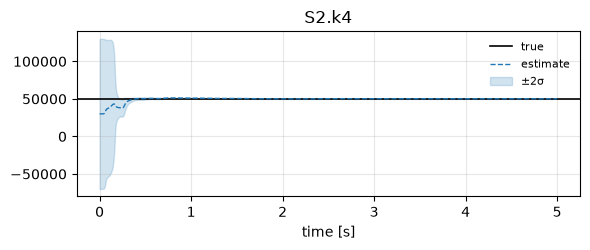
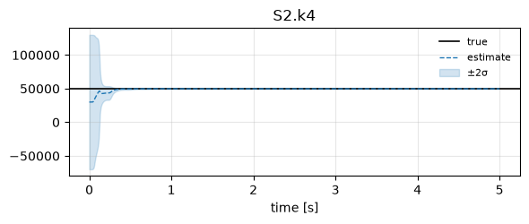
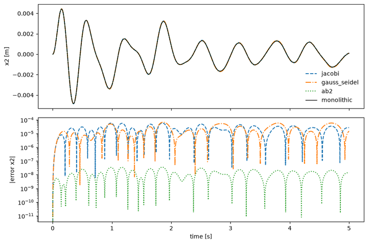
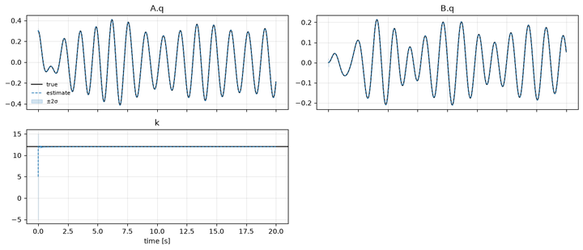
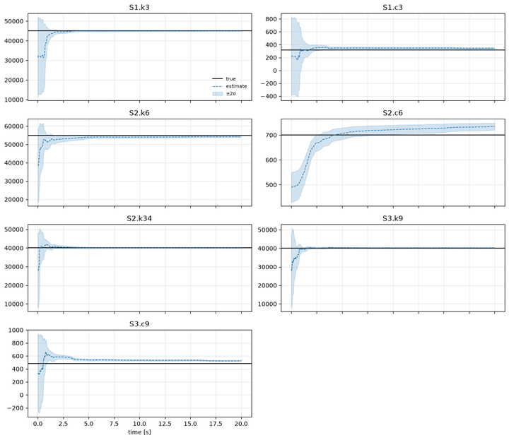
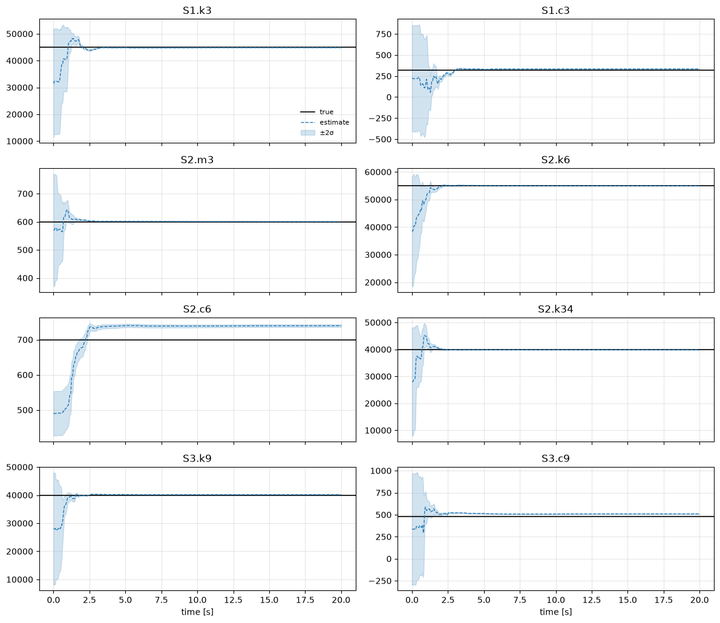
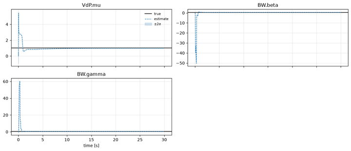

# Tutorials

Short, progressive, **runnable** tutorials for the `pci` library. Every tutorial has a
**YAML twin**: the same problem written declaratively and solved with one call to
`pci.solve`. They follow the paper's mass-spring testbeds, then leave them behind
for subsystems you write yourself.

<div class="grid cards" markdown>

-   [](01_four_dof_jacobi_ukf.ipynb)

    __[1. Quickstart: the 4-DOF testbed](01_four_dof_jacobi_ukf.ipynb)__

    Two subsystems, two UKFs, Jacobi messages, one unknown stiffness. Truth, data,
    decomposition, estimation and plots in a dozen lines.

-   [](02_solve_from_yaml.ipynb)

    __[2. Problems in YAML](02_solve_from_yaml.ipynb)__

    The declarative route: one file, `pci.solve`, and a loop over overrides for
    schedule and filter studies. Bring your own measurements.

-   [](03_forward_jacobi_vs_gauss_seidel.ipynb)

    __[3. The forward problem](03_forward_jacobi_vs_gauss_seidel.ipynb)__

    `System.simulate`: Jacobi vs Gauss-Seidel vs AB2 against the monolithic model.

-   [](04_custom_subsystems.ipynb)

    __[4. Custom subsystems](04_custom_subsystems.ipynb)__

    Your own `f(x, u, p, t)`: a Duffing oscillator with an EKF next to a linear one
    with a UKF, and the same problem as equation strings.

-   [](05_six_dof_three_subsystems.ipynb)

    __[5. Six DOF, three subsystems, three filters](05_six_dof_three_subsystems.ipynb)__

    An explicit spring topology, seven unknowns, UKF / CKF / EKF side by side.

-   [](06_paper_six_dof_configurations.ipynb)

    __[6. The paper's 6-DOF system](06_paper_six_dof_configurations.ipynb)__

    One YAML baseline, a dozen variants: schedules, filters, inner iterations,
    integrators and partitions compared in a table.

-   [](07_vanderpol_boucwen.ipynb)

    __[7. Non-standard subsystems](07_vanderpol_boucwen.ipynb)__

    A Van der Pol oscillator coupled to a Bouc-Wen hysteretic element, both written
    as equation strings; three unknown nonlinear parameters.

</div>

## Run them yourself

```bash
pip install "pci-inference[all]"
jupyter lab examples/                      # open the .ipynb, or:
cd examples && python 01_four_dof_jacobi_ukf.py   # the paired .py runs top-to-bottom as a script
```

Each tutorial is a [jupytext](https://jupytext.readthedocs.io/) pair: the `.py` is the
readable source of truth, paired to a `.ipynb` with the executed outputs. Run the
scripts from the `examples/` directory so that the YAML twins are found. Tutorial 6
honours `PCI_T` (horizon in seconds, default 20; the paper uses 50).
